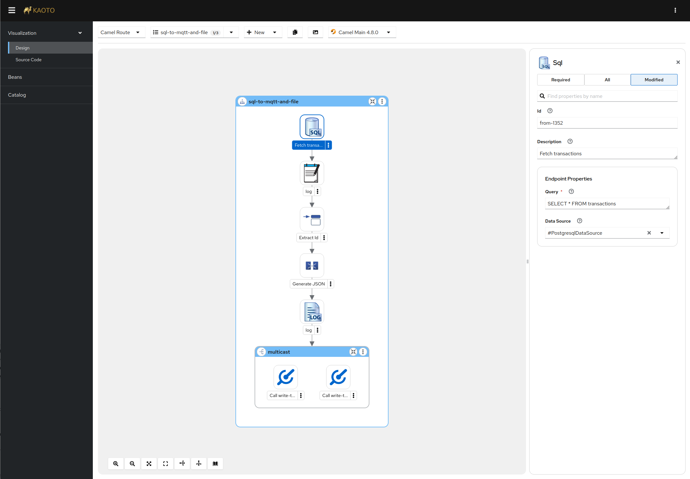

<h1 align="center">
  <a href="https://kaoto.io/"></a>
</h1>

<p align=center>
  <a href="https://github.com/KaotoIO/kaoto/blob/main/LICENSE"></a>
  <a href="https://www.youtube.com/@KaotoIO"></a>
  <a href="https://camel.zulipchat.com/#narrow/stream/441302-kaoto"></a>
  <a href="https://kaoto.io"></a>
  <a href="https://workspaces.openshift.com/#https://github.com/KaotoIO/kaoto?storageType=ephemeral"></a>
</p><br/>

<h2 align="center">Kaoto - The Integration Designer for <a href="https://camel.apache.org">Apache Camel</a></h2>

<p align="center">
  <a style="font-weight: bold" href="https://kaoto.io/docs/installation">Documentation</a> |
  <a style="font-weight: bold" href="https://kaoto.io/workshop/">Workshops</a> |
  <a style="font-weight: bold" href="https://kaoto.io/contribute/">Contribute</a> |
  <a style="font-weight: bold" href="https://camel.zulipchat.com/#narrow/stream/441302-kaoto">Chat</a>
</p>

<p align="center">
  
</p>

# Kaoto
Kaoto is a visual editor for Apache Camel integrations. It offers support in creating and editing Camel Routes, Kamelets and Pipes. Kaoto also has a built-in catalog with available Camel components, Enterprise Integration Patterns and Kamelets provided by the Apache Camel community.

Have a quick look at our online demo instance:
<a style="font-weight: bold" href="https://red.ht/kaoto">https://red.ht/kaoto</a>


## Table of Contents
- [Kaoto](#kaoto)
  - [Table of Contents](#table-of-contents)
  - [Requirements](#requirements)
  - [Getting Started](#getting-started)
    - [Clone the Repository](#clone-the-repository)
    - [Install Dependencies](#install-dependencies)
  - [Running kaoto with Docker](#running-kaoto-with-docker)
  - [Development](#development)
    - [Web Application](#web-application)
      - [Run](#run)
      - [Build](#build)
    - [Public Components](#public-components)
  - [Camel Catalog and Supporting Schemas](#camel-catalog-and-supporting-schemas)
  - [Storybook](#storybook)

## Development Requirements
- NodeJS (v22.x or higher) [+info](https://nodejs.org/en)
- Yarn (v3.x or higher) [+info](https://yarnpkg.com/getting-started/install)

> [!NOTE]
> For more information on Vite, check [Vite's documentation](https://vitejs.dev/config/).

## Browser Requirements
- Mozilla Firefox
- Google Chrome
- Microsoft Edge

> [!WARNING]
> Microsoft Internet Explorer and Safari are not supported

## Getting Started
### Clone the Repository
First, clone the repository to your local machine.

```sh
git clone https://github.com/KaotoIO/kaoto
```
### Install Dependencies

Navigate to the cloned directory and install the necessary packages.

```sh
cd kaoto
yarn install
```
_Note: By default, `@kaoto/camel-catalog` will also be built using the `mvn` wrapper._

## Running kaoto with Docker
For trial purposes, there is a docker image that can be run locally:

```sh
docker run --rm -p 8080:8080 --name kaoto quay.io/kaotoio/kaoto-app:main
```

## Development
### Web Application
#### Run
To start the development server, execute the following command:
```sh
yarn workspace @kaoto/kaoto run start
```
The application will be accessible at `http://localhost:5173` by default.

#### Build
To build the web application, execute:
```sh
yarn workspace @kaoto/kaoto run build
```

### Public Components
To build the public components, execute:
```sh
yarn workspace @kaoto/kaoto run build:lib
```

## Storybook

To view the storybook stories, go to [Chromatic](https://main--64ef22df8bb709ffa98c7a47.chromatic.com/). The stories are built for non-Dependabot pull requests and the link to storybook generated for PR is linked once the storybook is published. You can learn more about how to create a story for your UI component [here](https://storybook.js.org/docs/react/writing-stories/introduction).

To run Storybook locally:
``` bash
# first build the ui library
yarn workspace @kaoto/kaoto build:lib

# run the storybook
yarn workspace @kaoto/kaoto-tests storybook
```
To publish to Chromatic: `yarn workspace @kaoto/kaoto-tests chromatic`

<p align="center">
  <a href="https://redhat.com"></a>
</p>
