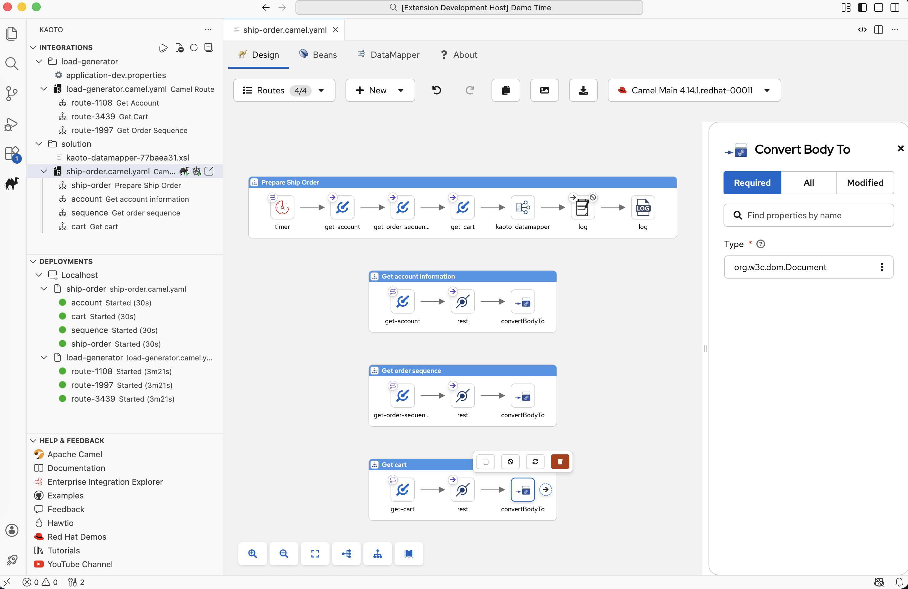
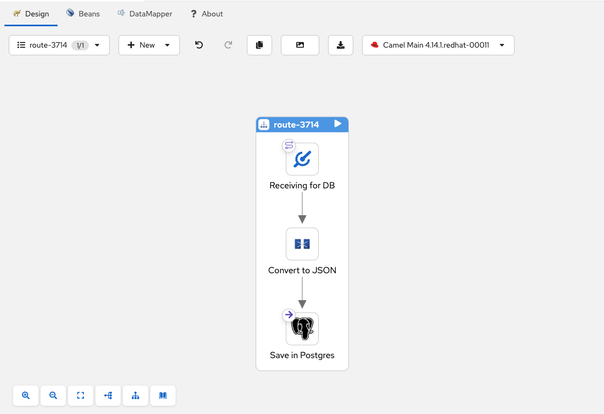
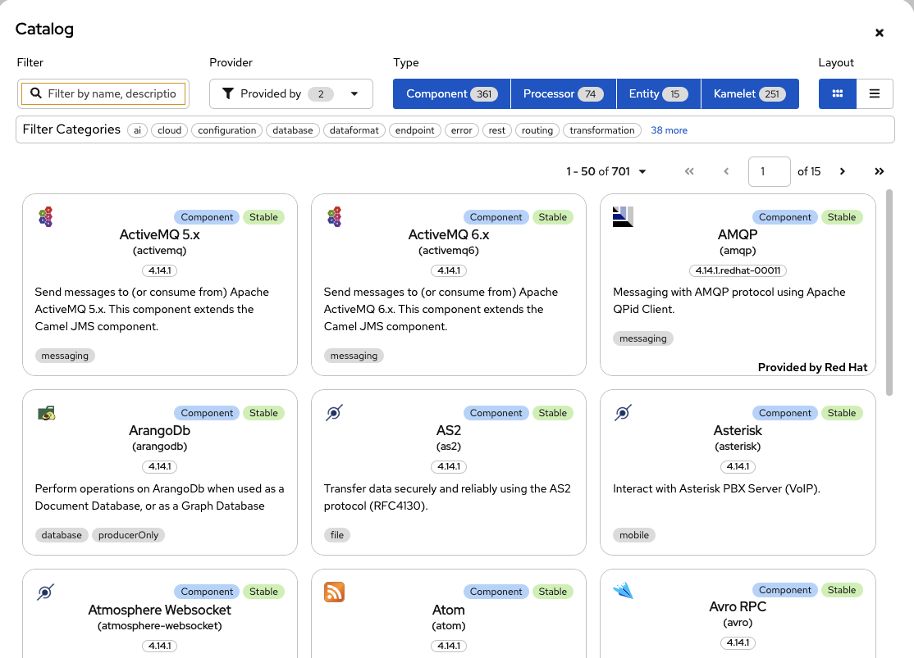
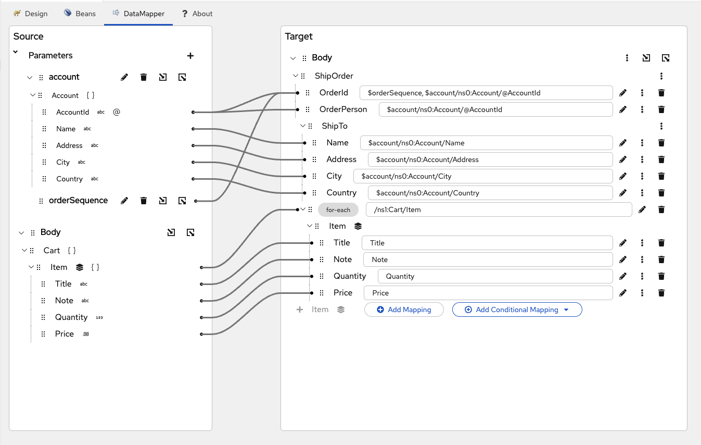
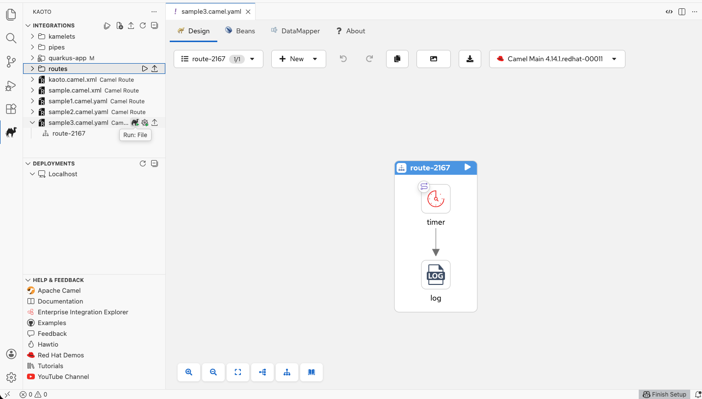
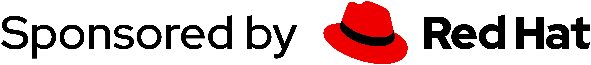

<h1 align="center">
  <a href="https://kaoto.io/"></a>
</h1>

<p align=center>
  <a href="https://kaoto.io"></a>
  <a href="https://kaotoio.github.io/kaoto/"></a>
  <a href="https://www.youtube.com/@KaotoIO"></a>
  <a href="https://github.com/KaotoIO/kaoto/blob/main/LICENSE"></a>
  <a href="https://camel.zulipchat.com/#narrow/stream/441302-kaoto"></a>
</p>

<h2 align="center">Kaoto - The Integration Designer for <a href="https://camel.apache.org">Apache Camel</a></h2>

<p align="center">
  <a href="#feature-highlights">Features</a> •
  <a href="#requirements">Requirements</a> •
  <a href="https://kaoto.io/docs/installation">Documentation</a> •
  <a href="https://kaoto.io/workshop/">Workshops</a> •
  <a href="https://kaoto.io/contribute/">Contribute</a> •
  <a href="https://camel.zulipchat.com/#narrow/stream/441302-kaoto">Chat</a>
</p>

<p align="center">
<a href="https://www.kaoto.io">Kaoto</a> lowers the barrier to getting started with <a href="https://camel.apache.org">Apache Camel</a>, enabling users to quickly prototype and integrate systems without deep Camel knowledge or complex Java coding. With a modern, open-source visual designer, Kaoto empowers teams to build and test integrations efficiently in a low-code environment, accelerating the development process.
</p><br/>

<p align="center"></p>

## Feature Highlights

<p align="center"><i>Kaoto has been designed with a focus on enabling users to quickly prototype Apache Camel integrations without deep Camel knowledge or having to write complex Java code.</i></p>

<table>
<tr>
<td width="33%" align="center">
<br/>
<b>Based on Apache Camel</b><br/>
<sub>Kaoto utilizes the Apache Camel models and schemas to always offer you all available upstream Camel features.</sub>
</td>
<td width="33%" align="center">
<br/>
<b>VS Code Extension</b><br/>
<sub>Kaoto comes as an extension you can easily install from the <a href="https://marketplace.visualstudio.com/items?itemName=redhat.vscode-kaoto">VS Code Marketplace</a>. Install it directly from inside your VS Code instance.</sub>
</td>
<td width="33%" align="center">
<br/>
<b>Care About Developers</b><br/>
<sub>Kaoto is a low-code / no-code visual editor for Apache Camel integrations. Using Kaoto will lower the barrier for integration developers to get started with Apache Camel.</sub>
</td>
</tr>
<tr>
<td width="33%" align="center">
<br/>
<b>Free Libre and Open Source</b><br/>
<sub>Truly open with no vendor lock-in. Use, reuse, share, modify, and resell to your needs. Own Kaoto and make it yours, making sure your use cases are covered.</sub>
</td>
<td width="33%" align="center">
<br/>
<b>Built-In Catalog</b><br/>
<sub>Kaoto provides you access to a catalog of 300+ Camel Components, 200+ Kamelets and a variety of Enterprise Integration Patterns to choose from. Each comes with documentation to help you get started.</sub>
</td>
<td width="33%" align="center">
<br/>
<b>Rapid Prototyping</b><br/>
<sub>Building your integration while running it in parallel in Dev Mode gives you a quick turnaround on your changes and enables you to quickly prototype your Camel routes.</sub>
</td>
</tr>
</table>

---

<table><tr>
<td valign="middle" width="40%">
<h3>Visual Integration Editor</h3>
Design your Camel routes, Kamelets and Pipes in a visual low-code / no-code way. Drag and drop components, connect them together, and see your integration flow come to life.
</td>
<td width="60%">

</td>
</tr></table>

---

<table><tr>
<td width="60%">

</td>
<td valign="middle" width="40%">
<h3>Built-in Catalog</h3>
Browse the comprehensive built-in catalog containing a vast number of available Camel Components (Connectors), Enterprise Integration Patterns as well as Kamelets provided by Apache Camel.
</td>
</tr></table>

---

<table><tr>
<td valign="middle" width="40%">
<h3>Easy Configuration</h3>
Selecting a figure on the graphical canvas will open up a configuration form to the right side which allows you to easily configure your components without writing code.
</td>
<td width="60%">

</td>
</tr></table>

---

<table><tr>
<td width="60%">

</td>
<td valign="middle" width="40%">
<h3>Built-in Data Mapping</h3>
Use the Kaoto DataMapper to map data between input and output structures and to transform it to your needs. Visually connect fields and apply transformations without writing complex code.
</td>
</tr></table>

---

<table><tr>
<td valign="middle" width="40%">
<h3>Powerful Sidebar Views</h3>
Browse integration files, orchestrate running Camel integrations, initialize new routes, export as Maven projects for Quarkus or Spring Boot, run locally, and deploy to OpenShift/Kubernetes - all from dedicated sidebar views.
</td>
<td width="60%">

</td>
</tr></table>

---

## Table of Contents

- [Kaoto](#kaoto)
  - [Kaoto Online](#kaoto-online)
  - [Requirements](#requirements)
  - [Getting Started](#getting-started)
    - [Clone the Repository](#clone-the-repository)
    - [Install Dependencies](#install-dependencies)
  - [Running Kaoto with Docker](#running-kaoto-with-docker)
  - [Development](#development)
    - [Web Application](#web-application)
      - [Run](#run)
      - [Build](#build)
    - [Public Components](#public-components)
  - [Storybook](#storybook)

## Kaoto Online

Have a quick look at our online demo instance: <a style="font-weight: bold" href="https://red.ht/kaoto">https://red.ht/kaoto</a>

## Kaoto Extension

Let's try also our Visual Studio Code extension from the **[VS Code Marketplace](https://marketplace.visualstudio.com/items?itemName=redhat.vscode-kaoto)** or **[Open VSX Registry](https://open-vsx.org/extension/)**

## Requirements

### Development Requirements

- NodeJS (v22.x or higher) [+info](https://nodejs.org/en)
- Yarn (v3.x or higher) [+info](https://yarnpkg.com/getting-started/install)

> ℹ️ For more information on Vite, check [Vite's documentation](https://vitejs.dev/config/).

### Browser Requirements

- Mozilla Firefox
- Google Chrome
- Microsoft Edge

> ⚠️ Microsoft Internet Explorer and Safari are not supported

## Getting Started

### Clone the Repository

First, clone the repository to your local machine.

```sh
git clone https://github.com/KaotoIO/kaoto
```

### Install Dependencies

Navigate to the cloned directory and install the necessary packages.

```sh
cd kaoto
yarn install
```

_Note: By default, `@kaoto/camel-catalog` will also be built using the `mvn` wrapper._

## Running Kaoto with Docker

For trial purposes, there is a docker image that can be run locally:

```sh
docker run --rm -p 8080:8080 --name kaoto quay.io/kaotoio/kaoto-app:main
```

## Development

### Web Application

#### Run

To start the development server, execute the following command:

```sh
yarn workspace @kaoto/kaoto run start
```

The application will be accessible at `http://localhost:5173` by default.

#### Build

To build the web application, execute:

```sh
yarn workspace @kaoto/kaoto run build
```

### Public Components

To build the public components, execute:

```sh
yarn workspace @kaoto/kaoto run build:lib
```

## Storybook

To view the storybook stories, go to [Chromatic](https://main--64ef22df8bb709ffa98c7a47.chromatic.com/). The stories are built for non-Dependabot pull requests and the link to storybook generated for PR is linked once the storybook is published. You can learn more about how to create a story for your UI component [here](https://storybook.js.org/docs/react/writing-stories/introduction).

To run Storybook locally:
```sh
# first build the ui library
yarn workspace @kaoto/kaoto build:lib

# run the storybook
yarn workspace @kaoto/kaoto-tests storybook
```

To publish to Chromatic: `yarn workspace @kaoto/kaoto-tests chromatic`

<p align="center">
  <a href="https://redhat.com"></a>
</p>
