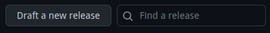
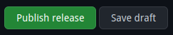

# kaoto-next
The next version of the UI for the Kaoto project.

## How to do a release
1. Update the version in all `package.json` files, f.i. `2.0.0-TP1`
2. Create a PR with the changes
3. After rebasing and merging the PR, create a new release in GitHub
    1. On the main page, click on Releases   
    2. Click on `Draft a new release`   
    3. Click on `Choose a tag` and fill the tag name, f.i. `2.0.0-TP1` and click `Create new tag: 2.0.0-TP1`   
    4. For `Target`, click on `Recent Commits`, choose the merged commit from the main branch (please avoid using the `main` branch as a target for the tag)   
    5. Click on `Generate release notes`   
    6. Lastly, click on `Publish release`   
4. After those steps, a new release will be created and the GitHub Action will start building the Docker image and push it to Quay.io. In addition to that, a new npm package will be published to the npm Package Registry.

