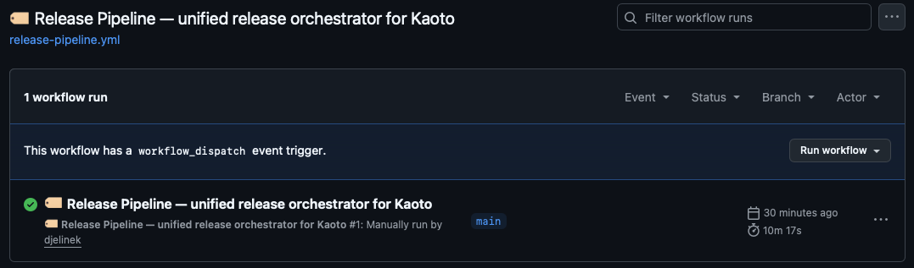
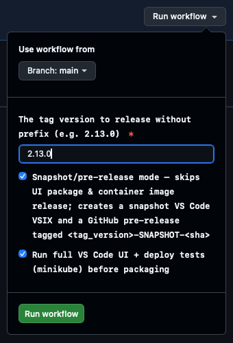
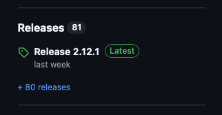

# Kaoto Release Process

Kaoto uses a unified release pipeline ([`.github/workflows/release-pipeline.yml`](.github/workflows/release-pipeline.yml)) that automates and coordinates the release of all components (VS Code extension, `@kaoto/kaoto` npm package, and Quay container image) under a single synchronized version.

---

## Release Workflow

### 1. Trigger the Release Pipeline

1. Go to the **Actions** tab on the Kaoto repository.
2. Select the **Release Pipeline — unified release orchestrator for Kaoto** workflow from the sidebar.

---

### 2. Configure Release Parameters

Click **Run workflow** and configure the required inputs:

- **`tag_version`** *(required)*: The release version without prefix (e.g. `2.13.0`). Monorepo workspace package versions are automatically synchronized in-place during the CI run.
- **`snapshot`**:
  - `false` for **official/production releases** (releases VS Code extension, `@kaoto/kaoto` npm package, and Quay container image).
  - `true` (*default*) for **snapshot pre-releases** (only packages a snapshot VSIX tagged `<tag_version>-SNAPSHOT-<sha>` and creates a GitHub pre-release).
- **`run_ui_tests`**: Set to `true` (*default*) to run full UI and minikube deployment tests before packaging.

---

### 3. Pipeline Execution & Automated Deliverables

Once triggered, the orchestrator coordinates sub-workflows in parallel:

- **VS Code Extension**: Builds the VSIX package, runs UI/deploy tests, and publishes to Open-VSX and VS Code Marketplace (on production release).
- **NPM Package**: Builds `@kaoto/kaoto` in library mode and publishes it to the npm registry (on production release).
- **Container Image**: Builds and pushes `quay.io/kaotoio/kaoto-app:<tag_version>` and `quay.io/kaotoio/kaoto-app:stable` (on production release).
- **Changelog**: Automatically parses Conventional Commits and generates categorized release notes grouped by subpackages (on production release).
- **Tag & Release**: Creates a single annotated git tag and publishes the GitHub Release.
  - *Production releases*: includes the generated changelog, VSIX, and CycloneDX SBOM.
  - *Snapshot releases*: uses a fixed pre-release description and attaches only the VSIX.

---

### 4. Re-running After a Partial Failure

If one or more jobs fail mid-release, re-trigger the pipeline with the **same `tag_version`** and the same `snapshot` value. All publish steps are idempotent:

- **VS Code Marketplace / Open-VSX**: `--skip-duplicate` silently skips the version if already published.
- **NPM**: checks the registry first and skips `yarn publish` if the version already exists.
- **Container image**: `docker push` overwrites the tag on Quay.io — safe to repeat.
- **Git tag**: skipped if the tag already exists on the remote.
- **GitHub Release**: uses `allowUpdates: true` — upserts the release and re-attaches artifacts.

> **Note**: the `tag-and-release` job downloads the VSIX (and SBOM on production releases) from
> GitHub Actions artifacts produced earlier in the same run. These are retained for **2 days**
> (snapshot) or **7 days** (production). If the retention period has elapsed before you re-run,
> re-trigger the full pipeline — the VS Code job will rebuild and re-upload the artifacts,
> and all already-published destinations will be skipped automatically.

---

### 5. Verify GitHub Release

After the workflow completes successfully:

1. Navigate to the **Releases** section on the repository homepage.
2. Verify the newly published release, its changelog release notes, and attached artifacts.

