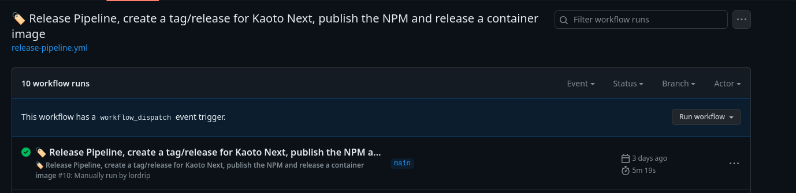
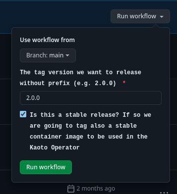

# kaoto-next
The next version of the UI for the Kaoto project.

## How to do a release
1. Update the version in all `package.json` files, f.i. `2.0.0`
2. Create a PR with the changes
3. After rebasing and merging the PR, trigger the Realese Workflow named `Release Pipeline, create a tag/release for Kaoto Next, publish the NPM and release a container image`. As the name implies, this Workflow will create the tag/release for the project. In addition to that, a new npm package will be published to the npm Package Registry and a new Docker image will be pushed to Quay.io.

    1. Make sure to fill the tag name , f.i. `2.0.0` and check the `Is this a stable release?` checkbox before running the workflow.
    
4. After the release generated by the workflow, edit the newly created release to generate release notes with the change log from the previous stable release.
    1. On the main page, click on the latest Release under the Releases section   
    2. Click on `edit` icon to edit the release datails   
    3. On the Release edit page, click on `Previous tag` dropdown to select the last stable release tag from which the change log will be generated.   
    4. Click on `Generate release notes`   
    5. Lastly, click on `Update release` to update the release notes with the change log   
