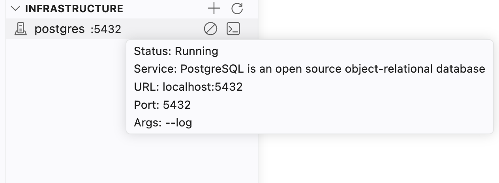
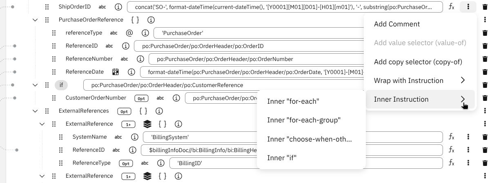
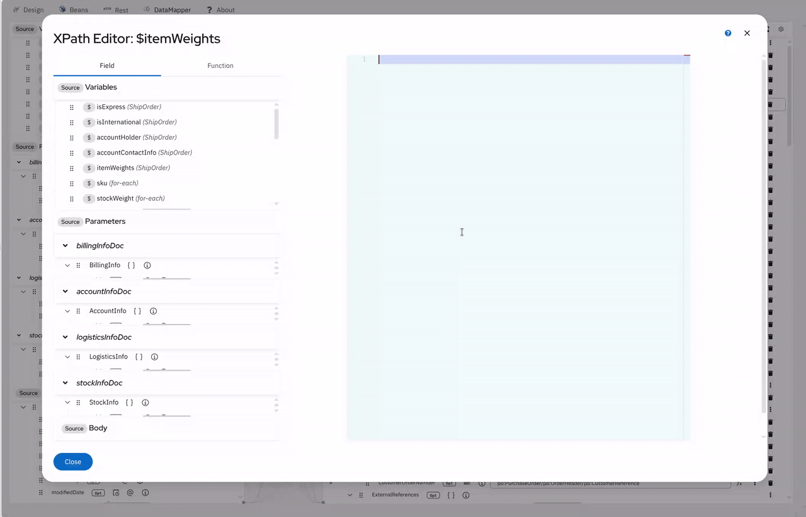

# Kaoto 2.12 released

We are happy to announce that new version of extension was released!

## Key highlights of this release

This release delivers three headline themes: a brand-new **Infrastructure view** for managing Camel infra services directly from VS Code; a dramatically more powerful **DataMapper** with XPath 3.1 / XSLT 3.0 function support, advanced schema handling (substitution group, abstract types, `xs:choice`), and improved XPath editor with function completion; and a set of **canvas and editor improvements**. Powered by Apache Camel 4.22.1.

---

### Infrastructure View _(experimental)_

A brand-new **Infrastructure** view has been added to the Kaoto sidebar. It integrates with `camel infra` to let you start, monitor, and stop Camel infrastructure services (databases, message brokers, and other backing services) without leaving VS Code.

> **This feature is experimental and hidden by default.** To try it out, enable the `kaoto.infrastructure.enabled` setting in your VS Code settings.

#### Start infrastructure services

Click the **+** button in the Infrastructure view toolbar to pick a service from the list of all services available via `camel infra`. You can optionally specify a custom port before the service starts — leave it empty to use the service default.

- The extension detects when a **container runtime** (Docker or Podman) is not available and shows a clear error message instead of a cryptic failure
- If a service is **already running externally** (started outside VS Code), you are prompted to either use the existing instance or stop and restart it

#### Monitor and manage running services

Each running service is shown as a tree item with its name, port (if known), and a status indicator (`starting`, `running`, or `stopping`). While at least one service is running, the view automatically refreshes to keep status up to date.

- **Stop** — hover over a service and click the stop button; a confirmation dialog prevents accidental stops
- **Show logs** — opens the dedicated VS Code terminal for the service so you can inspect its output
- **Copy URL / Copy port** — one-click clipboard actions for quickly wiring a service address into your integration configuration

    

---

### DataMapper: Enhanced mapping context menu

- **`Add copy selector`/`Add value selector`/`Duplicate` mapping context menu** - Mapping context menu now offers `Add value selector` to add  `xsl:value-of`, `Add copy selector` to add `xsl:copy-of` and `Duplicate` to add multiple mappings on a collection target field
- **`Wrap with Instruction`/`Inner Instruction` mapping context menu** - `Wrap with Instruction` and `Inner Instruction` sub categories are added to the mapping context menu, offering more flexible mapping instruction control 
- **Double click short cut for adding a mapping** - if you double click the target field, input field is shown right away to quickly write down a mapping XPath expression  

    

---

### DataMapper: XPath 3.1 & XSLT 3.0 Functions

The XPath expression editor has been significantly upgraded:

- **Function completion** — autocomplete suggestions for all XPath functions, including their signatures and descriptions, appear as you type
- **Hover help** — hovering over a recognised function name shows its documentation inline
- **XSLT 3.0 / XPath 3.1 function catalog** — a comprehensive catalog of function categories is now available, covering Math, Map, Array, Higher-Order functions, and XSLT-specific constructs

    

---

### DataMapper: Advanced Schema & Type Support

Several long-standing schema edge cases are now fully handled:

- **`xs:sequence` inside `xs:choice`** — you can now select a sequence branch within a choice field; Change/Clear context menu options, collection/cardinality inheritance, and nested choice clearing all work correctly
- **`xsi:type` attribute generation** — the XSLT output now emits `xsi:type` attributes when a SAFE type override is active, making the output self-documenting and allowing XML Schema validators to follow the type hierarchy without schema regeneration
- **Abstract type auto-detection** — XSLT-based auto-detection of wrapper field selections and substitutions, with automatic pruning of user-created fields that are no longer valid

---

### DataMapper: Variables & Grouping

- **`xsl:variable` support** — xsl:variable is now fully supported. variables defined inside the mapping context as well as the global level variables can now be used as source document nodes, mapped and referenced just like body or parameter fields
- **`xsl:for-each-group` support** — `xsl:for-each-group` is now fully supported including `xsl:sort`. It allows to create complex collection mapping with grouping and sort functionality enabled

---

### Custom Kamelet Improvements

Several quality-of-life fixes land for users who author and use custom Kamelets:

- **Live property refresh** — editing a custom Kamelet file on disk now immediately reflects new or changed properties in the config form of any route that uses it, without having to close and reopen the route file. Previously the stale cached definition was returned on every subsequent selection
- **Workspace Kamelets surfaced via VS Code API** — the extension now feeds workspace-local Kamelet files into the dynamic catalog pipeline through the editor channel API, so custom Kamelets are available to the catalog and form resolution without any manual configuration
- **Paste support for Kamelet templates** — copying and pasting a Kamelet or Pipe now correctly applies the pasted definition and rebuilds all child entities (beans, error handler, metadata) instead of leaving a blank canvas

---

### a2aSubTask EIP Support

The `a2aSubTask` (Agent-to-Agent Sub Task) EIP now renders correctly as a **step container** on the canvas, consistent with other container EIPs such as `aggregate`, `split`, and `saga`. Nested steps inside `a2aSubTask` can be added and managed visually.

---

### Camel Catalog 4.22.1

This release ships with the **Apache Camel 4.22.1** catalog (`@kaoto/camel-catalog 0.10.4`), bringing the latest components, EIPs, and Kamelet definitions from the Apache Camel community.

---

For a full list of changes please refer to the [change log.](https://github.com/KaotoIO/kaoto/releases/tag/2.12.0)

### Let's Build it Together

Let us know what you think by joining us in the [GitHub discussions](https://github.com/orgs/KaotoIO/discussions).
Do you have an idea how to improve Kaoto? Would you love to see a useful feature implemented or simply ask a question? Please [create an issue](https://github.com/KaotoIO/kaoto/issues/new/choose).

### A big shoutout to our amazing contributors

Thank you to everyone who made this release possible!

Whether you are contributing code, reporting bugs, or sharing feedback in our [GitHub discussions](https://github.com/KaotoIO/kaoto/discussions), your involvement is what keeps the Camel riding! 🐫🎉
