# Kaoto 2.8 released

We are happy to announce that new version of extension was released!

## Key highlights of this release

This release represents a major step forward in DataMapper maturity, with extensive XML Schema support improvements, better visual feedback, and numerous stability fixes. We've also enhanced the canvas experience with contextual menus and improved the forms system for better configuration management.

### VS Code

#### Getting started with Kaoto in VS Code

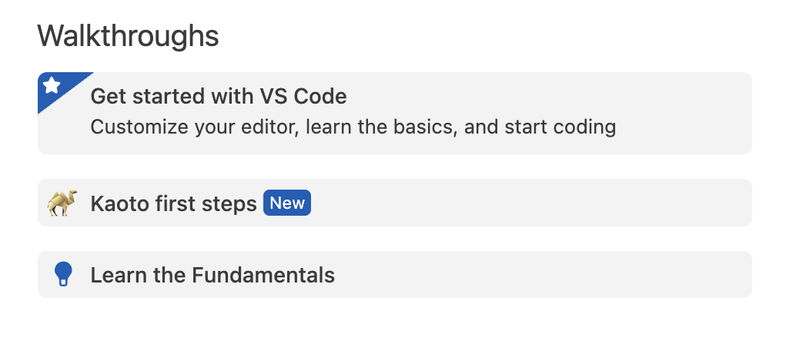

---

### Kaoto UI

#### Canvas enhancements

- **Contextual Menu**: Right-click on canvas nodes to access relevant actions directly where you need them
- **Keyboard Support**: Delete steps quickly by selecting them and pressing the Delete key
- **Improved Drag Feedback**: Different mouse pointer styles clearly indicate which nodes are draggable and which are not

    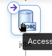
    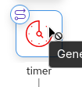

#### Forms and Configuration

- **Enum Field Support**: Improved component’s options when enum type is available

    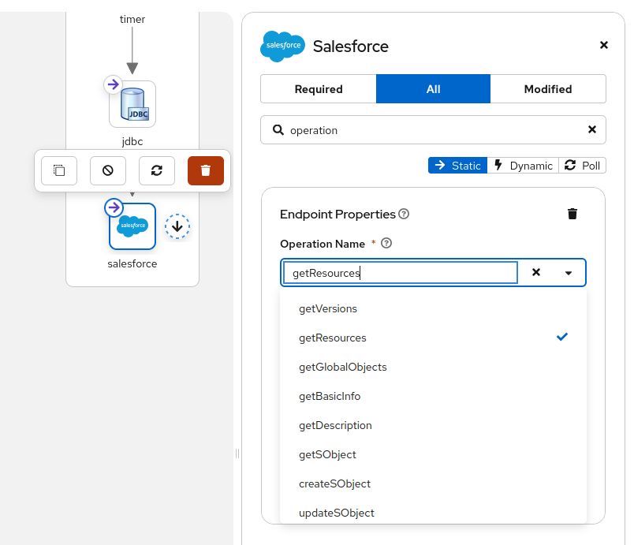
    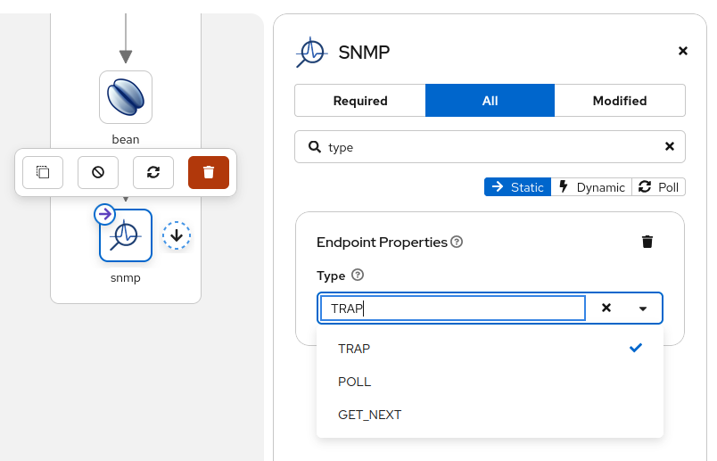

- **Beans EIP**: The beans EIP now shows a list of defined beans in the Camel route

    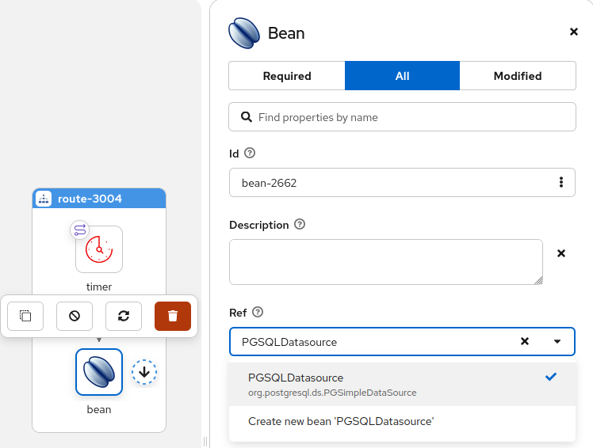

- **JDBC component**: The JDBC now shows the default and dataSource options and offers a list of beans to pick a dataSource from

    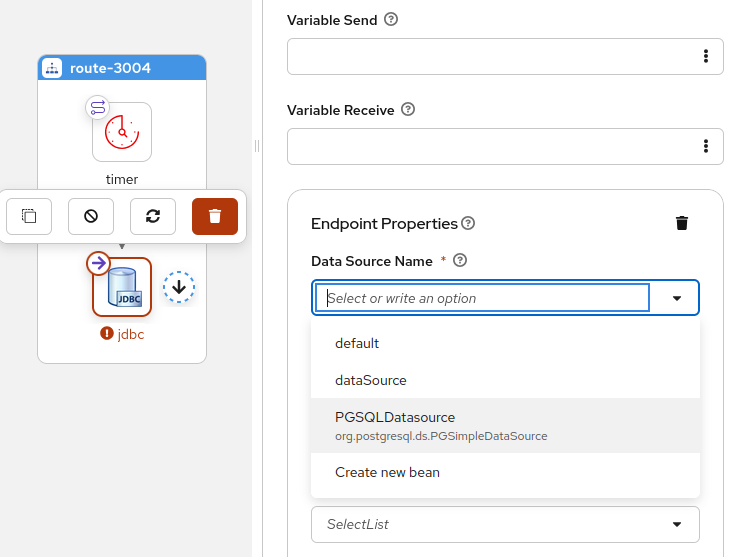

- **OnException Validation**: Enhanced validation for exception handling configurations

    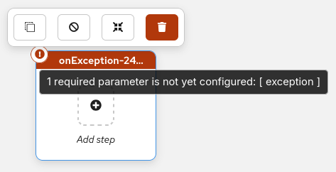

---

### DataMapper

#### XML schema support enhancements

Kaoto 2.8 brings improvements to XML Schema handling in the DataMapper:

- **Advanced Schema Features**: Full support for xs:extension, xs:restriction, allowing you to work with sophisticated XML schemas
- **Field Type Visualization**: Field type icons now appear in the tree view, making it easier to identify data types at a glance

    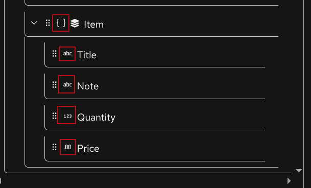
    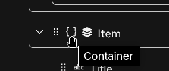
    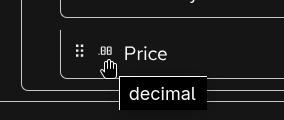

- **Occurrence Indicators**: Display of minOccurs and maxOccurs attributes helps you understand cardinality requirements directly in the UI

    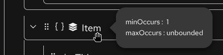

- **Improved XPath Handling**: Better support for relative xpath with parent (..) notation and current() function in expressions

    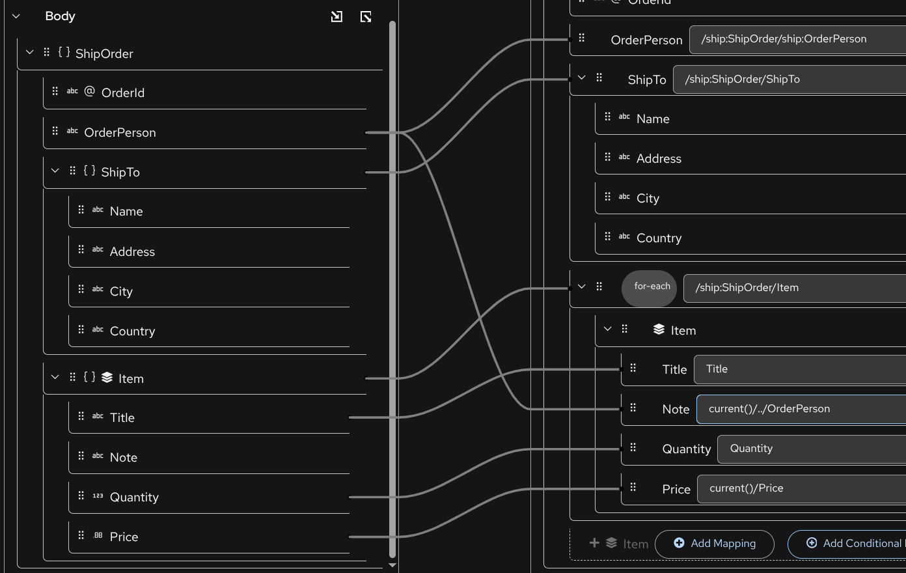

- **Parameter Renaming**: Rename parameters directly within the DataMapper interface

    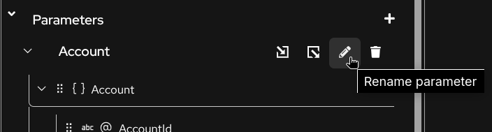
    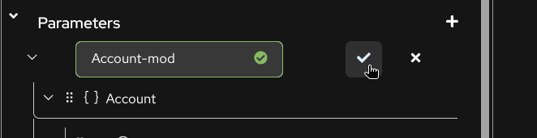

- **Smart Deletion**: Warning prompts when deleting mappings with child mappings to prevent accidental data loss

    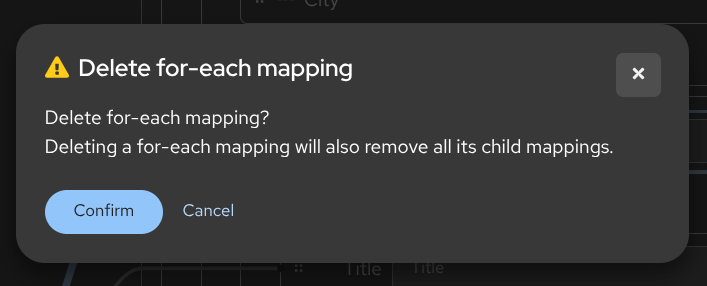

---

### Bug Fixes

- **URI Serialization**: Improved component parameter handling in XML URI serialization when no syntax is present
- **Route Ordering**: Fixed the order of Intercept\* elements to ensure correct processing sequence

### Camel Catalog Version

This release includes:

- Camel main: 4.16.0
- Camel extensions for Quarkus: 3.29.0
- Camel Spring-boot: 4.14.1
